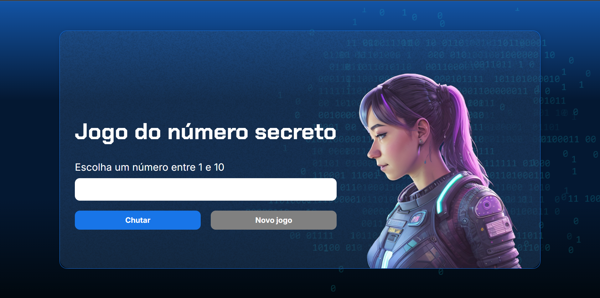
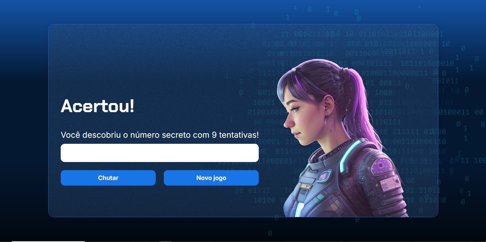

# 🎲 Jogo do Número Secreto 

Bem-vindo ao repositório do **Jogo do Número Secreto**! Este projeto consiste em um jogo interativo onde o jogador deve adivinhar um número aleatório entre 1 e 10.

## 📘 Introdução

Este projeto foi desenvolvido como parte do curso **"Lógica de programação: explore funções e listas"**, oferecido pela [Alura](https://www.alura.com.br/).

O objetivo do jogo é reforçar conceitos de lógica de programação, como o uso de funções, loops e listas, de forma divertida e prática.

---

## 🛠️ Ferramentas Utilizadas

As principais ferramentas e tecnologias utilizadas no desenvolvimento deste projeto foram:

- **JavaScript**: Linguagem de programação principal do projeto.
- **Node.js**: Para execução e testes no ambiente local.
- **Visual Studio Code**: IDE utilizada no desenvolvimento.

---

## 💻 Desenvolvimento

O projeto segue a seguinte estrutura:

1. **Geração de Número Aleatório**: O número secreto é gerado automaticamente a cada nova partida.
2. **Entrada do Jogador**: O jogador insere um número entre 1 e 10 como tentativa.
3. **Validação e Resposta**: O programa verifica se a tentativa está correta e informa o resultado ao jogador.
4. **Reinício do Jogo**: O jogador pode jogar novamente após cada tentativa.

Além disso, o código foi escrito com atenção às boas práticas de programação, incluindo o uso de funções para modularizar as responsabilidades do jogo.

### Exemplo de Código
```javascript
function verificarChute(){
    let chute = document.querySelector('input').value;
    console.log(chute == numeroSecreto);

    if(chute == numeroSecreto){
        exibirTextoNaTela('h1', 'Acertou!');
        let palavraTentativa = tentativas > 1 ? 'tentativas' : 'tentativa';
        let mensagemTentativas = `Você descobriu o número secreto com ${tentativas} ${palavraTentativa}!`;
        exibirTextoNaTela('p', mensagemTentativas);
        document.getElementById('reiniciar').removeAttribute('disabled');
    } else if (chute > numeroSecreto) {
        exibirTextoNaTela('p', 'O número secreto é menor');
    } else {
        exibirTextoNaTela('p', 'O número secreto é maior');
    }
    tentativas++;
    limparCampo();
}
````
### Screenshots

#### Página Inicial


#### Tela de Vitória


---


## 📜 Conclusão

O desenvolvimento deste jogo simples demonstrou como conceitos fundamentais de lógica de programação podem ser aplicados para criar algo divertido e interativo. Foi uma experiência enriquecedora para praticar o uso de funções, manipulação de entrada do usuário e a lógica por trás de jogos de adivinhação. Além disso, o projeto exemplifica como pequenos programas podem ser usados para consolidar habilidades e incentivar o aprendizado contínuo.

Se você gostou deste projeto ou tem sugestões de melhoria, fique à vontade para contribuir abrindo uma **issue** ou enviando um **pull request**.

---

## 👥 Créditos

Este projeto foi desenvolvido como parte do curso da [Alura](https://www.alura.com.br/), com instrução de:

- [Guilherme Lima](https://www.linkedin.com/in/guilherme-lima-alura/) ([GitHub](https://github.com/guilherme-lima))
- [Mônica Mazzochi Hillman](https://www.linkedin.com/in/monica-mazzochi-hillman/) ([GitHub](https://github.com/monica-mazzochi-hillman))

---

## 📩 Contato

Caso tenha dúvidas ou queira saber mais sobre o projeto, entre em contato através da aba de **Issues** ou envie uma mensagem diretamente para mim pelo [GitHub](https://github.com/MMCAC).
